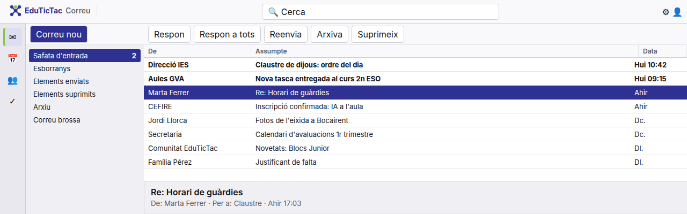
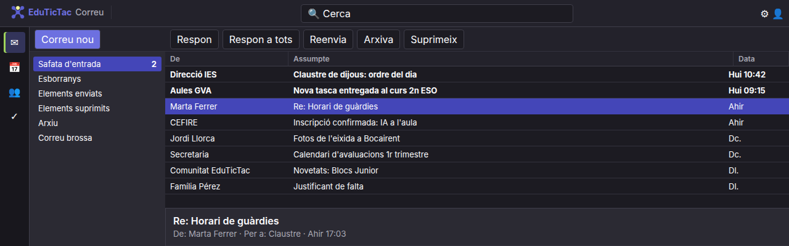

# EduTicTac Correu Clàssic

Extensió per a navegador que vist **Outlook web** amb l'aspecte d'un client de
correu d'escriptori clàssic (tres panells, llista compacta en forma de taula,
barres d'eines planes), amb la imatge de la **Comunitat EduTicTac**.

És un projecte per a divertir-se: no afig funcions a Outlook ni llig el correu,
només canvia com es veu.

| Tema clar | Tema fosc |
|---|---|
|  |  |

*Captures sobre una maqueta amb l'estructura d'Outlook web.*

## Què fa

- Recoloreja Outlook amb la paleta EduTicTac (indi i verd de la marca)
  sobreescrivint els tokens de color de Fluent UI i del tema d'Outlook.
- Tema **automàtic** (segueix el sistema), **clar** o **fosc**.
- Panell de carpetes gris, selecció plena, llista amb separadors fins i
  capçaleres de columna de taula, opció de files alternes.
- Marca EduTicTac a la barra superior.
- Diagnòstic al popup: indica quins elements d'Outlook ha reconegut, per a
  ajustar la pell quan Microsoft canvia l'estructura.

Funciona a `outlook.office.com`, `outlook.office365.com`,
`outlook.cloud.microsoft` i `outlook.live.com`.

## Instal·lació (mode desenvolupador)

**Chrome / Chromium / Edge:** `chrome://extensions` → activa *Mode de
desenvolupador* → *Carrega desempaquetada* → tria esta carpeta.

**Firefox:** `about:debugging#/runtime/this-firefox` → *Carrega un complement
temporal* → tria `manifest.json`.

### Perquè quede més clàssic

A Outlook: *Configuració › Correu › Disseny*:

- **Panell de lectura:** a baix.
- **Disseny de la llista de missatges:** una sola línia.
- **Densitat:** compacta.

## Empaquetar

```bash
./scripts/package.sh
```

## Com funciona

Tot l'aspecte és CSS (`content/theme.css`), dins de la classe
`html.ett-classic`, que `content/content.js` posa o lleva segons la
configuració. Per això desactivar-la torna Outlook a l'estat original sense
recarregar. Els selectors fan servir atributs estables (`role`, `id`,
`aria-*`) i no les classes generades d'Outlook, que canvien a cada
desplegament. Les files de la llista no canvien d'alçada perquè la llista és
virtualitzada.

## Marques

No està afiliat a Microsoft ni a Mozilla. *Outlook* és una marca de
Microsoft. L'estètica s'inspira en els clients de correu d'escriptori clàssics,
sense fer servir logotips ni noms d'altres projectes.

## Llicència

MIT. Logotip i imatge: Comunitat EduTicTac.
